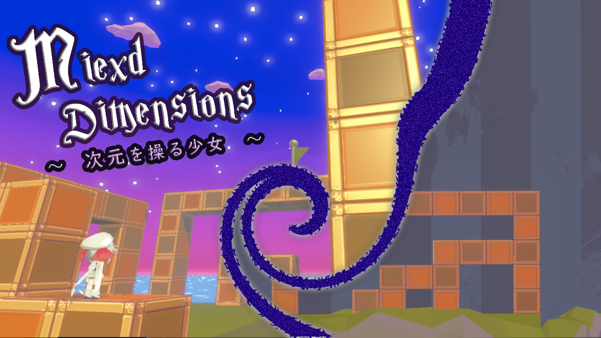
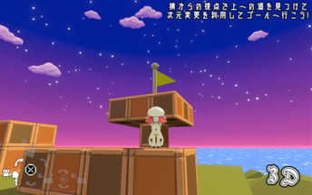
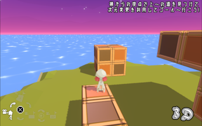
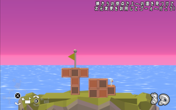
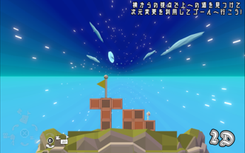

# Mixed Dimensions  
## 概要  
>ジャンル: ローグライク  
>制作人数: 2人  
>担当箇所: シェーダとステージ制作以外のすべて  
>製作期間: 2ヶ月  
>制作時期: 2年次  
>>#### 開発環境
>>エンジン: Unity  
>>言語: C#  
>>ツール: Paint.net  
>>使用アセット: DoTween, Unity Excel Importer Maker, Easy Performant Outline
>実行環境:  
>>OS: Windows 10  
>>RAM: 8GB  
>>GPU: Intel i5-8250U  
  
## ゲーム内容  
次元を操ることが出来る少女が2次元と3次元を行き来して上にある旗を目指して道を切り開くパズルアクションゲーム。
3次元にすれば地形を把握しながら自由に行き来できる。
2次元にすれば奥行きがなくなり遠くのオブジェクトでも乗ることが出来る。
その特徴を生かし、次元を切り替えながらゴールを目指していこう。
  
### [WebGL版のゲームを実行](https://nakaireo.github.io/WebGL_MixedDimensions/)
  
## 開発目的  
学校の行事の一つである展示会等も近かったので、それに向けた制作であると共に、
この年のゲーム大賞のアマチュア部門である「メビウスの輪」をテーマに作った作品でもある。  
今までに作ったゲームは2Dの物が多かったので、3Dの知識が少ないと考えたので3Dゲームを作ろうと考え、
メビウスの輪から色々な角度から見ることで平面上の形が変わるという部分からこのゲームのアイデアを得た。  
結果として、ゲーム大賞は賞を取ることは出来なかったが、その後に開催したゲームクリエイター甲子園では
「新小田裕二賞」を頂くことが出来ました。
そして、展示会の方でも学内2位かつクラス内1位の評価を頂くことが出来ました。  
  
## 頑張った点
- タイトルのUI
- ポストプロセスとシェーダーを使ったアニメ調の世界観の演出
- 現在の入力に応じた操作
	- Gamepadなら仮想カーソルを表示
	- 現在の入力に応じて操作方法のUIを切り替える
- Prefabを置いたりするだけで簡単に作れるステージエディター
- 色々な人の環境に合わせやすいように設定を豊富に
- 様々な視点のカメラの管理
- 2次元と3次元のカメラの補間処理

## スクリーンショット
  
### [紹介動画 - Youtube](https://www.youtube.com/watch?v=kaU5I6UDMAc)
  
### [プレイ動画 - Youtube](https://www.youtube.com/watch?v=QkeASmB6M58)  
  

